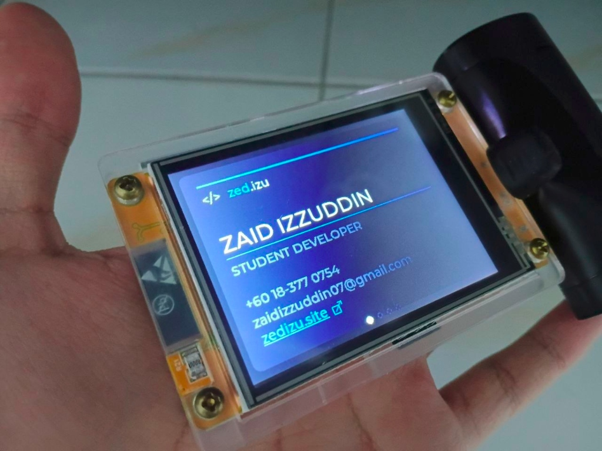

# 📇 ESP32 Business Card (Cheap Yellow Display)



An interactive digital business card running on the **ESP32 Cheap Yellow Display (CYD)** (specifically the `ESP32-2432S028R` 2.8" TFT touchscreen model). Built with LVGL 8 — swipeable cards showing my identity, contact info, and project portfolio. Tapping any project opens a live QR code.

> **Hardware project by [Zaid Izzuddin](https://zedizu.site)** — feel free to fork, remix, and build your own.

---

## ✨ Features

- **4 swipeable tiles** with smooth animated transitions
- **Tile 0 — Identity Card**: Name, title, phone, email, animated underline reveal, tappable portfolio QR
- **Tile 1 — QBike**: Bicycle booking system project card + QR
- **Tile 2 — SwitchOff!**: IoT wall-switch automation project card + QR
- **Tile 3 — YouFIM**: AI financial advisor project card + QR
- **QR modal overlay**: Full-screen QR code with URL label and close button
- **Touch-zone aware**: Separate sensitivity tuning for nav zones vs. button zones
- **Page indicator dots**: Active dot grows and fills white; inactive dots are dim outlines

---

## 🔧 Hardware

| Component | Details |
|---|---|
| **Development Board** | **ESP32 Cheap Yellow Display (CYD)** / `ESP32-2432S028R` |
| **MCU** | ESP32-D0WDQ6 (dual-core Tensilica LX6) |
| **Display** | 2.8" ILI9341/ILI9341V TFT LCD — 320×240, SPI |
| **Touch Controller** | XPT2046 resistive touch (on-board, same PCB as display) |
| **Backlight** | Active HIGH via GPIO21 |


### Wiring — Display (TFT_eSPI / ILI9341)

| Signal | ESP32 GPIO |
|---|---|
| MOSI | 13 |
| MISO | 12 |
| SCLK | 14 |
| CS | 15 |
| DC | 2 |
| RST | — *(not connected / tied to 3.3V)* |
| BL (Backlight) | 21 |

### Wiring — Touch (XPT2046, separate SPI bus)

| Signal | ESP32 GPIO |
|---|---|
| MOSI | 32 |
| MISO | 39 |
| CLK | 25 |
| CS | 33 |
| IRQ | 36 |

> The touch controller runs on the ESP32's **VSPI** peripheral to avoid bus conflicts with the display.

---

## 📦 Dependencies

All managed automatically by PlatformIO — no manual installation needed.

| Library | Version |
|---|---|
| [bodmer/TFT_eSPI](https://github.com/Bodmer/TFT_eSPI) | `^2.5.43` |
| [PaulStoffregen/XPT2046_Touchscreen](https://github.com/PaulStoffregen/XPT2046_Touchscreen) | latest (git) |
| [lvgl/lvgl](https://github.com/lvgl/lvgl) | `^8.3.11` |

---

## 🚀 Getting Started

### Prerequisites

- [VS Code](https://code.visualstudio.com/) + [PlatformIO IDE extension](https://platformio.org/install/ide?install=vscode)
- A USB cable connected to your ESP32

### Build & Flash

```bash
# Clone the repo
git clone https://github.com/urnword/BussinesCard.git
cd BussinesCard

# PlatformIO will auto-fetch all libraries on first build
# In VS Code: click the ✓ (Build) button, then → (Upload)

# Or via CLI:
pio run --target upload
```

### Monitor Serial Output

```bash
pio device monitor --baud 115200
```

---

## 🗂️ Project Structure

```
BussinesCard/
├── src/
│   └── main.cpp          # All firmware — UI, touch, LVGL setup
├── include/
│   └── lv_conf.h         # LVGL build configuration (fonts, modules)
├── lib/                  # (empty — all deps via platformio.ini)
├── platformio.ini        # Board config, build flags, pin definitions
└── .gitignore            # Excludes .pio build cache
```

---

## ⚙️ Configuration

All pin definitions and display driver settings live in `platformio.ini` as `-D` build flags — no `User_Setup.h` file needed.

To adapt this to a different display or wiring, edit the `build_flags` section in `platformio.ini`:

```ini
build_flags =
    -D TFT_MOSI=13
    -D TFT_MISO=12
    -D TFT_SCLK=14
    -D TFT_CS=15
    -D TFT_DC=2
    -D TFT_RST=-1
    -D TFT_BL=21
    ; Change ILI9341_2_DRIVER to match your panel
    -D ILI9341_2_DRIVER=1
```

---

## 📄 License

MIT — see [LICENSE](LICENSE). Do whatever you want with this.
